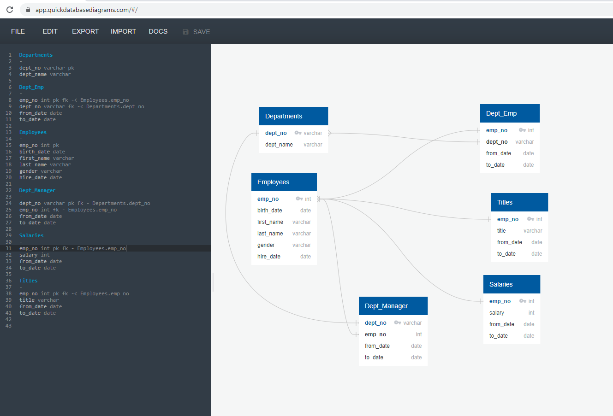
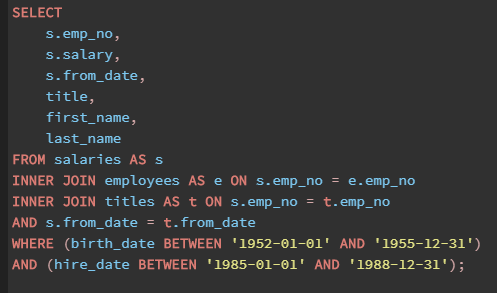
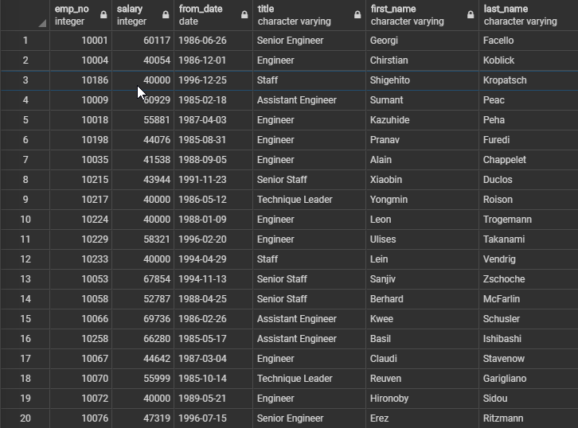
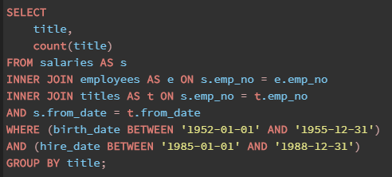
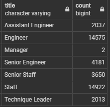
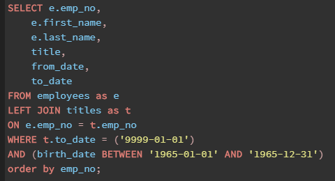
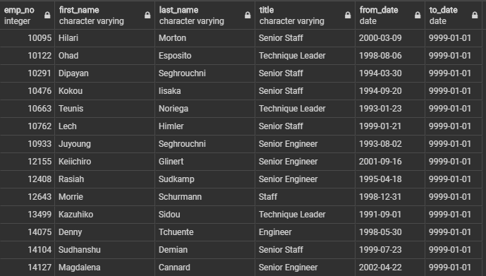

# Pewlett-Hackard-Analysis

## Project Summary:  Use advanced sql queries and joins to create data lists for the HR department to analyze retiree data for a possible mentorship program.

ERD Diagram:

### Requested Queries:

#### Number of [titles] retiring

**Purpose:** The purpose of this query is to create a list of persons who are eligible to retire and their title.  This list was designed to help analyze how many people across what job titles could possibly be retiring to determine functional gaps that will be a result of retirements.  In writing this query, I ran into some issues with duplicate names because of the title table.  Upon further review of the title and salary tables and their corresponding dates, the current title matched the current salary from date.  Connecting the from_date from these tables eliminated duplicated names and providing the most current title and salary.

**SQL Code:**

 

**Output Sample:**

 

#### Only the Most Recent Titles

**Purpose:**  This query was designed for a quick glance at how many people in each title are eligible to retire.  This gives the user a quick look into where the most mentors are most likely needed.  In this query I did notice the most needed position of retirees are under the title ‘Staff”.  The HR department should consider a more precise title to continue with their analysis.

**SQL Code:**

 

**Output:**

 
 
#### Who's Ready for a Mentor?

**Purpose:** This query is designed to show the current employees who would be eligible to be in a mentorship program to eventually fill retiree positions.  A quick count table per title would also be recommended to see how the people retiring vs people available match up title for title.

SQL Code:

 

Output:

